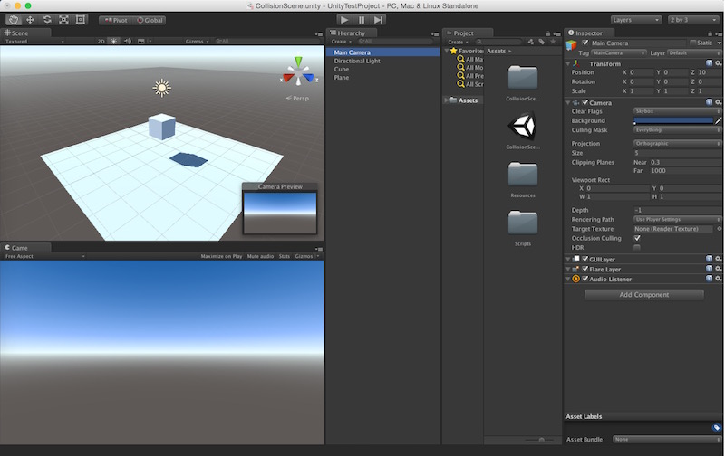
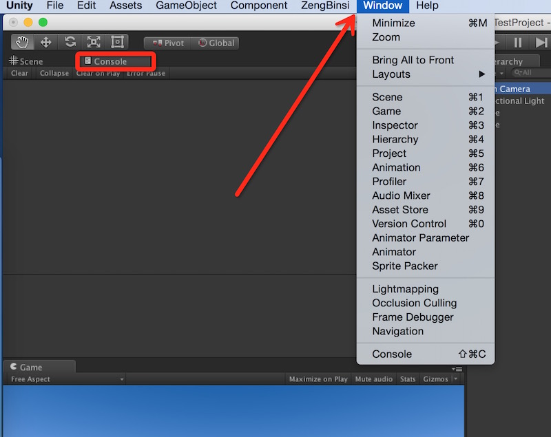

# Unity编辑器常用视图介绍

打开Unity编辑器的主窗口，在窗口的右上角可以看到有个“Layout”按钮。这是用来对Unity编辑器主窗口上面的各个窗口面板进行布局的。通常情况下我个人比较习惯使用“**2 by 3**”的布局方式，所以，我会将Layout设置成该布局。

 
然后我们可以看到如上图所示的布局。
 
该布局在主窗口左边竖排两个面板，从上到下分别是“**Scene**”和“**Game**”。
 
* Scene面板用来可视化编辑游戏场景，可以多游戏内部的物体对象进行布置或者说是布局。而Game视图可以实时看到游戏运行起来的效果。
* Game对应的画面就是主相机拍摄到的画面，我们可以称之为视窗。视窗的大小是可以通过相机对象进行调节的。游戏运行时，Unity会将相机拍摄到的视窗画面投影在对应的设备屏幕上面。

除了左边的两个面板，在主窗口的右边还水平横排三个面板，从左往右依次是“**Hierarchy**”面板、“**Project**”面板和“**Inspector**”面板。

* Hierarchy是Unity的层次面板，上面显示了当前游戏场景内所有的游戏物体对象（游戏对象GameObject）。并且包含了它们的层次结构，子对象会显示在父对象的下面，并缩进一格。
* Project是游戏的项目目录，里面主要是包含Assets面板。Assets面板上显示的都是项目的资源文件等。
* 最右边的Inspector是Unity的检查器面板，或者我们也可以通俗点叫它“属性面板”。当我们选择一个游戏对象或者一个文件对象的时候，Inspector就会显示出对象上面挂载的组件信息或者对象的属性信息。我们可以直接在Inspector面板上面修改这些信息。

除了这五个常用的视图面板之外，Unity还有很多的窗口帮助我们更好的进行开发。我们可以在Unity顶部的菜单栏上面找到“Window”选项，然后点击我们需要的视图面板即可打开。通常我会将Console（控制台）视图面板放在Scene视图的位置，方便我在运行游戏时查看日志信息。

**（其实首次接触Unity 3D这个引擎是2014年的7月份，当时见到它就挺喜欢的，只是因为某些原因一直没有去了解它。最近正好开始想要去学习这个深受开发者喜爱的引擎，便想写点东西作为记录，以备后面查询。）**