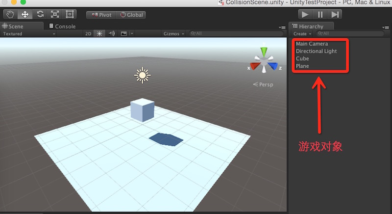
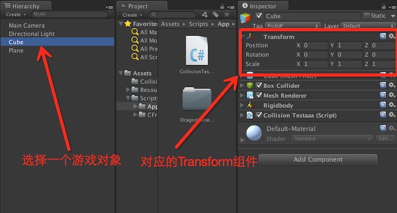
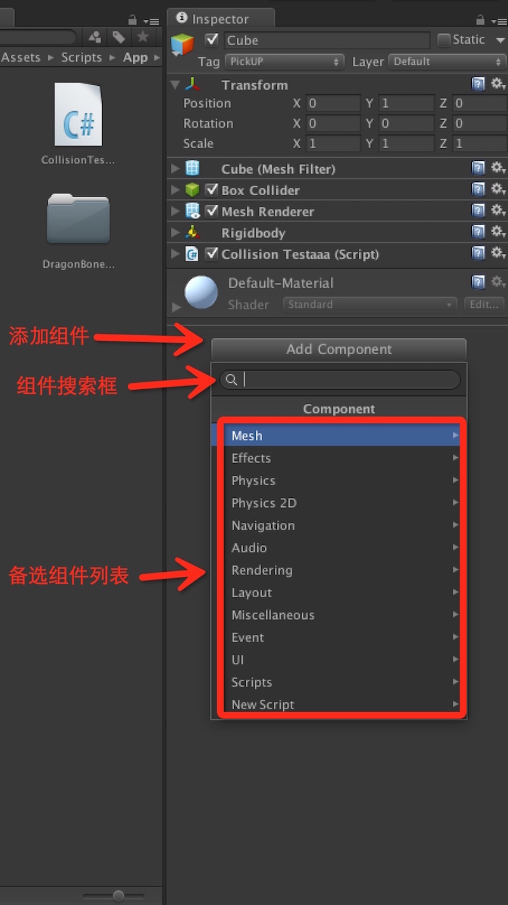

# Unity3D 场景、游戏物体和组件的概念

游戏和电影一样，是通过每一个镜头的串联来实现的，而这样的镜头我们称之为“场景”。一个游戏一般包含一个到多个场景，这些场景里面实现了不同的功能，把它们组合起来就变成一个完整的游戏了。

## 一、场景中的游戏对象
在电影里面，每个镜头会包含布景，然后还会有演员在表演，摄像机将表演的画面记录下来，然后就变成了电影。同样的，在Unity游戏里面也同样存在相机，它的作用也是将游戏的画面展示在游戏设备的显示屏上面。所不同的是，Unity游戏里面，不论是布景还是人物，所有的东西我们都称之为“GameObject”游戏对象（2D游戏一般称之为“精灵”）。所以游戏场景是由游戏对象组成的，一个场景就相当于是一个独立的世界，我们可以简单的把游戏场景理解成是游戏对象的一个容器。

Unity的Hierarchy面板上显示的就是场景当前拥有的游戏对象，当游戏处于运行状态，Hierarchy面板上面的对象也会跟着游戏在实时地刷新。一个新建的游戏场景里面会默认添加一个Main Camera（主相机）对象和一个Directional Light（方向光源）对象。主相机负责将游戏场景投影到屏幕，方向光源负责照亮整个场景。当我们将方向光源从场景里面删除后，由于场景里面没有光源，游戏运行后屏幕上只能看到一个很暗的画面。而如果我们将主相机对象从场景里面移除的话，游戏运行时我们将无法看到任何游戏画面。

在电影里面，角色会有各种信息，比如角色的身份标签、性格，甚至他的职能。同样的，我们的游戏对象也同样可以拥有各种信息，而这些信息都是以“组件”（Component）的方式存在的。游戏对象是由一个到多个组件组成的，我们可以将组件看成是组成一台机器的零部件。Unity游戏是通过组件的方式进行开发的，所以想要操作游戏对象也都是通过操作对应的组件对象。

在Hierarchy面板上面或者Scene视图中随便选择一个游戏对象，然后我们就可以在Inspector面板上面看到对应的组件信息。一般，游戏物体都至少会拥有一个名为“Transform”的组件。它是游戏物体的基本组件，里面包含游戏物体在场景中的基本属性信息。

## 二、Transform组件

Transform有三个重要的属性组成，分别是：“position”、“rotation”和“scale”。

* position包含的是游戏对象在场景中的位置信息，其数据类型是“Vector3”（三维向量），由x、y和z三个坐标分量组成。
* rotation表示的是游戏物体在场景中的旋转角度信息，其数据类型是“Quaternion”（四元数），Quaternion.Euler(x, y, z)方法可以将x、y和z三个轴上面的旋转角度分量转换成一个欧拉角（Euler），并返回一个Quaternion对象。所以我们可以看到Transform的Rotation属性同样包含x、y和z三个值。
* scale表示的是游戏物体在场景里面的缩放比例，默认为1。同样，它也分x、y和z三个分量，所以它的值同样是使用Vector3类型来表示。

## 三、给游戏对象添加组件

当我们需要给游戏物体添加新的组件的时候，我们可以简单的点击Inspector面板最后一个组件下方的“Add Component”按钮来添加。在按钮下面会出现一个组件选择面板，该面板顶部会有一个搜索框，可以直接输入组件名称进行检索。下面的备选列表里面列举了Unity内置的组件，我们也可以通过它们的分类来查找想要的组件。

以下是组件的分类： 

1、Mesh：网格组件。 

2、Effects：效果组件。
 
3、Physics：物理组件。 

4、Physics 2D：2D物理组件。 

5、Navigation：导航组件。 

6、Audio：音频组件。 

7、Rendering：渲染组件。 

8、Layout：布局组件。 

9、Miscellaneous：其它组件。 

10、Event：事件组件。 

11、UI：UI元素组件。 

12、Scripts：已创建的脚本组件。 

13、New Script：新建一个脚本组件。
 
每个分类下面基本都包含了多个组件。