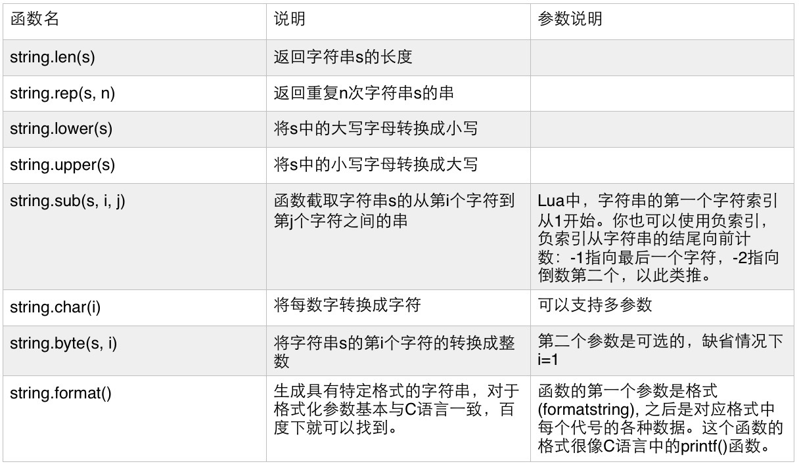

# quick-cocos2d-x Lua语法基础

使用quick-x开发游戏有两年时间了，quick-x是cocos2d-Lua的一个豪华升级版的框架，使用Lua编程。相比于C++，lua的开发确实快速便捷了许多，下文只是lua这门语言的一个基础知识点，没有涵盖整个Lua的内容，但是作为对lua入门的初步了解还是可以的，由于内容精简了不少，所以语言上可能会有点跳跃，但是问题不大。

要了解一门语言，首先要了解的是语言的标识符、保留字、常量和变量，命名规范和注释以及数据类型等。然后是运算符、控制流语句和一些常用的函数方法之类的东西。最后再涉及面向对象的内容等等。

## 一、标识符（命名规范）

按照上面的顺序，我们首先来看下Lua的标识符和保留字的内容吧。标识符就是语言给变量、常量、方法（函数）、对象和类等指定的名字。每一门语言都有自己的一套命名规范，虽然有些语言的命名规范略有差异，但是基本上是一致的，这也算是行业的一些潜规则吧。

### 1.1、命名规范
Lua的标识符有以下几点要求：

1、严格区分大小写，即person和Person是不同的标识符。

2、在字符组成上，Lua同样满足可以由下划线、字母和数字组成，并且首字符不能是数字的要求。除此之外，Lua标识符还支持美元符号组成，即“$num_111”这样的标识符是合法的。

3、不能使用关键字（保留字）作为标识符。

### 1.2、关键字

所谓的关键字（保留字）是在语言中具有特殊意义的符号，每一门语言都会定义一些具有某些特殊含义的保留字，下面我们罗列下Lua的主要关键字：

1、语言基础：nil、local、function、type。

2、逻辑判断：and、or、not、true、false。

3、流程控制：return、break。

4、分之语句：if、then、else、elsif、end。

5、循环语句：do、while、for、in、repeat、until。

### 1.3、常量

在C、C#、Java等语言中，常量只能在声明的时候初始化，之后就不能更改它的值。然而对Lua这种动态脚本语言而言，它并没有常量与变量之分，两个其实是一样的，都是变量，都可以在初始化后随意修改它的值。我们在声明常量的时候通常使用全大写字符组成，不同单词之间以下划线分隔。如：

	MY_NAME = “clarence” 
	
### 1.4、变量

Lua中声明一个变量是在标识符前面加上local关键字来声明一个局部变量，不加local关键字的就是全局变量了。变量的命名方式是首字符小写，采用驼峰命名法。如：

	local myName = “clarence”
	name = “zengbinsi”
	
**每个语言都有每个语言的命名规范，虽然不是强制要求的东西，但是一个好的命名风格会让你的代码更加美观和易于维护。Lua基本上和其他语言一致，除了上面提到的常量与变量的命名规范之外，在类名上，Lua一般采用首字符大写的驼峰命名法，而对象的命名法和变量的一致。另外，方法函数一般采用动词开头，首字母小写，后面每个单词首字母大写的驼峰命名法进行命名。**

## 二、代码注释

在Lua中，代码注释主要分两种：单行注释（- - 注释内容）和多行注释（- - [[ 可换行注释内容 ]] - -）。如：

	--  单行注释
    local num ＝ 621  - - 声明一个变量num，并赋值。
    --[[ 

        这里是多行注释

        print(“Hello World!”)
    ]]--

## 三、数据类型

### 3.1、基本数据类型

Lua和Javascript一样同属于动态语言，所以它的类型是在赋值的时候才确定下来的，并且后期重新赋值的时候会再次确定新的类型。Lua主要的数据类型有：数值类型（number）、布尔类型（boolean）、字符串类型（string）、函数类型（function）、线程（thread）、表类型（table）、自定义类型（userdata）和空值（nil）。

* 数值类型可以保存实数，包括整数和小数，整数包括十进制和十六进制，十六进制的整数是以“0x”开头的一串数字序列。
* 布尔类型的值只有两种：true和false，用于表示“真”和“假”。
* 字符串类型是由0个或者多个被双引号（“”）或者（’’）包裹的字符序列。
* 函数类型，Lua里面的函数类型也是第一类值，所谓的第一类值的意思就是函数和我们普遍认识的字符串、数字之类的类型是一样的，可以保存在一个变量里面，可以重新赋值，也可以当成函数的实参传递到其他函数内部等等。
* 线程类型可以同时执行多个（多线程），每个线程会开辟独立的栈区、局部变量等。
* 表类型类似于其它语言的数组或者字典类型，但是它比数组或者字典类型更加强大，它是使用大括号（｛｝）表示的，创建表类型的代码如下：

 

	--  数组形式
	local nums = {2, 1, 5, 6, 1, 1,}
	--  字典形式
	local diction = {key1 = 9, key2 = 8, key3 = 4, key4 = “Y”, 
		key5 = “z”, key6 = ’n’,}
	
 

* 自定义类型，Lua是用C语言开发出来的一门轻量级的编程语言，连编译器都是用C编写的。Lua可以通过自定义类型与C语言进行交互，可以将任意的C语言类型存储到Lua的自定义类型的变量中，以此来完成交互逻辑代码。

### 3.2、获取Lua类型

Lua里面提供了一个内置函数type()，用于返回指定变量和数值的类型，如：

	print(type(489116))             	--  输出：number。
	print(type(“ax”))             		--  输出：string。
	print(type({“z”, name = ‘x’, 7 = “x”,}))     --  输出：table。

## 四、基础数据类型转换（string和number）

谈数据类型，就难免要说到数据类型转换。lua提供了tostring()函数用来将布尔类型和数值类型转换成字符串类型，提供tonumber()函数来将非数值类型的变量转换成数值类型，如果无法进行转换则返回nil。如：

### 4.1、转成字符串类型。

	print(tostring(true))         --  输出“true”
	print(tostring(215.61))       --  输出“215.61”
	print(tostring(1984))         --  输出“1984”
	
### 4.2、转成数值类型。

	print(tonumber(“953.555”))     --  输出953.555
	print(tonumber(“732.0”))     --  输出732
	print(tonumber(true))         --  输出nil
	print(tonumber(“abc123”))     --  输出nil
	print(tonumber({1,  “2”,}))     --  输出nil 
	
**另外，tonumber()函数可以接收两个参数，第一个参数是要转换的值，第二个参数是转换后的进制基数，默认为十进制。**

## 五、运算符（算术、关系和逻辑运算符）

在语言中，进行科学计算的符号称为“运算符”，运算符和常量或者变量可以组成表达式。Lua中的运算符也分为：算术运算符、关系运算符和逻辑运算符三种。

### 5.1、算数运算符

算数运算符包括：加（+）、减（-）、乘（*）、除（/）、取余（%）和幂（^）。这个幂运算符在其他语言里面并不常见，或者说根本没有。但是在数学里面，例如要求2的3次幂，只需要写“2 ^ 3”即可，其他语言要写成“2 * 2 * 2”。

### 5.2、关系运算符

关系运算符用于表示两个表达式的大小关系，返回的值是布尔类型的true（成立）或者false（不成立）。关系运算符分为：大于（>）、小于（<）、大于等于（>＝）、小于等于（<=）、等于（==）和不等于（~=）六种。

### 5.3、逻辑运算符

逻辑运算符是对布尔类型进行运算，返回值也是布尔类型。逻辑运算符分为：逻辑与（and）、逻辑或（or）和逻辑非（not）三种。

### 5.4、运算符优先级
运算符的优先等级顺序如下所示：

## 六、控制流语句（顺序、分支和循环的流程控制）

在结构化的程序设计中，有且只有三种最基本的控制流语句，分别为：顺序语句、分支语句和循环语句。

### 6.1、分支语句

在Lua中没有switch语句，所有的分支只能用if语句来进行实现。

#### 6.1.1、单分支

	if 条件表达式 then 
        分支语句块
	end}
	
#### 6.1.2、双分支

	if 条件表达式 then 
        分支语句块1
	else
		分支语句块2
	end
	
#### 6.1.3、多分支

		if 条件表达式1 then 
            分支语句块1
        elseif 条件表达式2 then 
            分支语句块2
        elseif 条件表达式3 then 
            分支语句块3
        elseif 条件表达式4 then 
            分支语句块4
        …
        else
            分支语句块n
        end

多分支中最后一个else都是可以省略的。

### 6.2、循环语句

在Lua中，循环语句除了while和for之外，还有一个repeat循环语句。

#### 6.2.1、while循环

	while 条件表达式 do
		循环体
	end
	
#### 6.2.2、for循环

##### 6.2.2.1、数值型for

	for 循环控制变量 ＝ 初始值, 终止值, 循环控制变量变化步长 do
		循环体
	end

##### 6.2.2.2、泛型for

		for i, v ipairs(数组) do
            循环体
        end

        for i, v pairs(集合) do
            循环体
        end
        
这里相当于是一个迭代器，使用ipairs()函数进行迭代时，里面只能跌带出有下标索引的项。然后将每一项值保存在v变量里面，i表示当前循环次数。pairs()函数可以迭代集合里面所有的项，但是顺序和数组里面保存的顺序不一致。

#### 6.2.3、repeat循环

	repeat
		循环体
	until 条件表达式
	
repeat语句和while语句差不多，只是条件在执行过一遍循环体之后才验证，类似其它语言的do...while语句。

### 6.3、其它控制流语句

除了这最基本的三种控制流语句之外，Lua还支持return语句和break语句来改变程序执行的流程，但是**Lua不支持continue语句**。

break语句可用于三种循环结构。当程序执行到break语句时，程序将跳出当前循环体，不再继续执行循环体的其他语句了。

return语句可以终止当前语句块的调用，返回到调用该语句块的语句处。return 语句后面可以接0个到多个返回值，这和其他语言的单一返回值不同。每个返回值以逗号（,）分隔。

## 七、万能的table数据类型

现在，我们再来探讨下table（表类型），前面我们已经说过table可以表示数组和字典，但是远比这些强大。这是因为table是Lua中唯一一个能够用于描述数据结构的数据类型。它本身其实就是一个字典类型，在面向对象中，它甚至可以用于描述类和对象。

首先，我们看下字典类型的定义：

	local dic1 = {id = 1, date = “2015/09/16”,}
	local dic1 = {[“id”]= 1, [“date”] = “2015/09/16”,}
	
上面这两种声明方式只是key的写法不同，在用法上面并没有什么区别。要访问上面声明的字典我们可以使用如下代码：

	print(“dic1.id = ” .. dic1.id)
	print(“dic1.id = ” .. dic1[“id”])
	
数组我们也是通过table来实现的，我们可以将数组看成是key为有序数列的一个字典。声明一个数组的代码如下：

	local arr = {21, “yun”, ‘中’, “56”,}
	
访问数组的语法基本与C语言等一致，比如访问数组的第个元素，代码如下：

	--  Lua数组索引是从1开始的，和其他语言从0开始不同。
	print(“arr[1] = ”, arr[1])
	
在数组名称前面加上“#”运算符可以获得数组的长度，在旧版本的Lua中也可以使用table.getn(数组变量)函数来获取长度。

	print(“arr的长度是：” .. #arr)         --  输出4 
	
另外，Lua语言还给table提供了两个常用的函数用于插入数据和删除数据。

插入数据使用table.insert()函数，这个函数有三个参数，第一个是table类型变量，第二个是要插入到table中的值，第三个是可选参数，表示要插入的位置索引，默认在最后一个。

删除数据使用table.remove()函数，这个函数有两个参数，第一个是table类型变量，第二个是要删除的索引。

最后，我们在遍历table的时候一般使用ipairs()函数来遍历数组，而字典一般使用pairs()函数。ipairs()函数和pairs()函数在遇到空置（nil）时停止遍历，它会认为已经遍历到末尾了。

## 八、强大的string字符串类型

Lua中的字符串是一串连接被双引号或者单引号包裹的字符序列，值得注意的是Lua拼接字符串使用的是“ .. ”符号，而非C#等其它语言的加号（+）。Lua的字符串库里面提供了很多方便的函数让我们的编码更加的方便快捷。

## 九、不同于其它编程语言的function函数类型

已经具备了语言的基础语法，我们接下来看下高阶一点点的函数。对于第一次看到“函数”这个词的人，很难不联想到数学上的函数。确实我们可以这么认为，函数有函数名、参数和返回值。函数名就是用来标记函数的标识符（比如：正比例函数、反比例函数等），参数就相当于自变量x，返回值可以看成是因变量（函数值）y，而整个函数体就可以看成是函数的公式。

编程时，我们通常将一些反复执行的代码放到一个代码块里面，这个代码块就是我们的函数。Lua的函数分为局部函数和全局函数。Lua定义函数的格式如下：

	function 函数名(参数列表)
		函数体
		return 返回值
	end

一般情况下函数都应该有返回值，如果没有返回，Lua默认返回nil。定义局部函数就是在function关键字前面加上local修饰就可以了。

值得注意的是Lua的函数比较特殊，它支持多返回值。例如：

	--  函数定义
    function getNum(a, b)
        return a, b, a + b
    end
    --  函数调用
    local a, b, c = getNum(2, 1)

    print(a, b, c)     -- 输出2 1 3

## 十、神奇的函数闭包

说到函数就不得不提函数闭包，闭包可谓是语言的强大特性之一。闭包的创建相对容易，人们甚至会在不经意间创建闭包，但这些无意创建的闭包却存在潜在的危害，比如内存积压得不到释放等等。我们先来看下闭包的创建，代码如下：

	function methodA()
        local str = "HelloWorld"

        -- 声明内部函数
        local methodB = function() 
            print(str)
        end

        -- 将函数返回
        return methodB
    end 

    -- 调用methodA得到methodB
    local fn = methodA() 

    -- 在methodA函数外部调用得到的methodB函数
    fn()
    
通常来说我们在函数methodA里面定义的变量之类的东西在函数返回之后都会被释放掉，但是上面这种情况比较特殊。函数methodA执行后将内部的函数methodB返回出去了，并且这里的methodB还访问了methodA的局部变量str。那么Lua为了保证返回出去的函数能够在外部正常的访问，会将methodA保留了下来，并且里面的局部变量也不会被释放掉，这就形成了一个闭包。里面methodB定义的那行我们称为闭包表达式。

闭包的使用有好处也有坏处，在通常情况下我们应该尽量消除不必要的闭包，防止内存暴涨带来的坏处。

