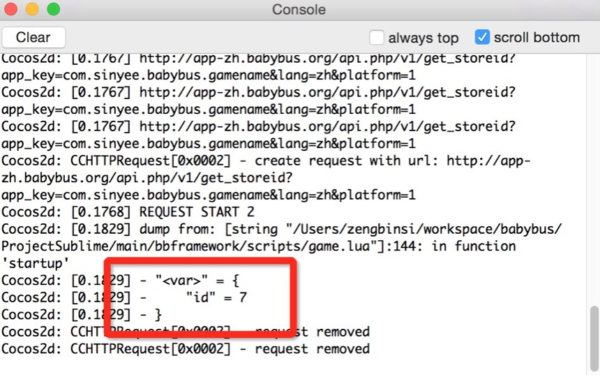

# quick-cocos2d-x Lua 面向对象(OOP)编程与元表元方法

## 一、面向对象
面向对象是一种对现实世界理解和抽象的方法，是计算机编程技术发展到一定阶段后的产物。 

早期的计算机编程是基于面向过程的方法，通过设计一个算法就可以解决当时的问题。随着计算机技术的不断提高，计算机被用于解决越来越复杂的问题。面向过程式的编程思想很难良好的解决这些复杂的问题，通过面向对象的方法，更利于用人理解的方式对复杂系统进行分析、设计与编程。同时，面向对象能有效提高编程的效率，通过封装技术，消息机制可以像搭积木的一样快速开发出一个全新的系统。

但是随着软件行业的飞速发展，渐渐的有人开始觉得面向对象编程让代码显的非常复杂，工程庞大。开始有一部分人回归到了面向过程编程，开始运用面向对象和面向过程结合的方式进行开发。 

面向对象最主要的两个概念就是对象和类，能够充分理解这两个概念的人自然也很容易理解面向对象的编程思想。 

所谓对象，就是用来描述客观存在的一个实体，它是构成系统的一个基本单位。一个对象应该由若干属性组成，这些属性用于描述这个实体的信息，比如某个人的名字。另外还应该包含一些方法，用于描述实体的动作，比如某个人吃饭的过程。 

类是具有相同属性和方法的所有对象实体的抽象，类的内部为这些对象提供了统一的抽象描述。比如所有人都有名字，那么“人”这个类就应该包含一个属性叫做人名。所有的人都有这个属性，类的方法也是一样的道理。 

## 二、Lua模拟简单的对象
Lua语言中没有类的定义，也不能定义类，但是我们可以使用table来模仿对象，如下：

	--  定义一个表来模拟对象，将id和name看成的它的属性
    local person = {id = 2156, name = "yzn",}
    --  给对象添加方法
    function person.sayHello(self) 
        print("你好，我的名字是" .. self.name)
    end
    - - 访问属性
    print(person.id)
    - -  调用方法 
    person:sayHello()
    
接下来我们来访问person的属性和调用sayHello方法。发现无论是语法还是效果上面都和Java等其它语言操作对象的方式极其类似。

## 三、点和冒号调用方法的区别
值得注意的是我在调用方法的时候person后面用的是冒号（:）来调用sayHello方法，而不是使用一点。这其实是Lua的一个语法糖衣，使用冒号调用的时候Lua会自动将调用者当成函数的第一个参数的实参传递到函数内部去。所以我就没有传递参数给sayHello的self参数那边。 

也是就是：

	person:sayHello()
	
等价于

	person.sayHello(person)
	
冒号和点号只是用来决定是否需要手动传递第一个参数而已。 

## 四、模拟类（元表和元方法）
现在我们来看下类是如何模拟出来的：

	-- 定义一个Person表，当成类。添加一个属性id，和一个方法toString
    Person = {
        id          = "1", 
        toString    = function(p)
            print("id = ", p.id)
        end
    }

    -- 给Person再添加一个new函数，用于实例化对象。
    function Person.new()
        -- 定义一个表，当成被实例化出来的对象
        obj = {}
        -- 设置表的元表
        setmetatable(obj, Person)
        -- 设置__index方法为自身
        Person.__index = Person
        -- 返回创建的实例对象
        return obj 
    end

    -- 调用new函数实例化对象
    local obj = Person.new() 
    -- 访问属性
    print("obj.id = ", obj.id)
    -- 调用方法
    obj:toString()
    
其实Lua中就是通过设置元表的方式来实现继承关系的，这里所谓的类和对象，其实就是让一个obj表继承Person这个表（设置obj的元表为Person）。然后设置元方法__index为Person，这样我们访问obj的id属性时，它在自己的表中没有找到就会调用元方法__index去元表里面找，也就是去Person里面去找，然后返回了Person的id属性的值，方法调用也是一样的。如果没有设置__index，那么没有找到会直接返回nil。

元表和元方法，是Lua内置的一些操作。Lua的每个变量都具有一张元表，我们可以通过getmetatable(var)函数得到对象的元表。而对于setmetatable()方法，设置元表只能针对于table类型的变量。要修改设置其他值的元表，我们需要通过C的API来实现。

table默认是没有设置其元表的，我们可以通过以下代码进行验证：

	local tab1 = {1, 2, 3}
	print(getmetatable(tab1))  -- 输出nil   
	
其实所谓的元表就是一个普通的表，我们现在来设置下tab1的元表：

	local tab1  = {1, 2, 3}
	-- 定义一个普通的空表作为元表
	local mt    = {}
	setmetatable(tab1, mt)
	print(getmetatable(tab1))  -- 输出table  
	
我们甚至可以给上面的mt添加一个项，然后获取出tab1的元表进行dump查看是否就是mt：

	local tab1  = {1, 2, 3}
	-- 定义一个普通的空表作为元表
	local mt    = { id = 7, }
	setmetatable(tab1, mt)
	dump(getmetatable(tab1))  -- 输出表里面的所有内容
	
我在quick-player模拟器上面运行，控制台窗口输入的内容如下图所示。

我们可以清晰的看到确实是设置元表成功了。 

接下来我们来重载Lua的运算符。Lua的运算符是通过元方法进行计算的，元方法分为算数元方法和关系元方法。Lua的元方法都是以双下划线开头的，比如上面提到的__index等。 

所谓的算数元方法就是在进行算数运算的时候会被调用的方法。比如进行加法的__add和减法的__sub。我们这里以加法运算符为例，在进行重载加法运算符（+）之前，对两个table进行相加肯定活报错。所以，我们现在先对加法进行重载，代码如下：

	local tab1  = {"a", "b", "c"}
    -- 定义一个普通的空表作为元表
    local mt    = {}
    -- 设置tab1的元表为mt
    setmetatable(tab1, mt)
    -- 重写元方法 
    mt.__add    = function(t1, t2)
        local t = {}

        for i, v in ipairs(t1) do
            table.insert(t, v)
        end

        for i, v in ipairs(t2) do
            table.insert(t, v)
        end

        return t 
    end

    -- 定义另一个table
    local tab2  = {"d", "e",}

    -- 对tab进行加法运算，会触发__add元方法
    local tab3  = tab1 + tab2 
    -- 打印计算后的结果
    dump(tab3)
    
运行后看到打印的tab3的值如下所示： 

可见我们重载是成功了，其他的元方法重载和加法的基本一致。

