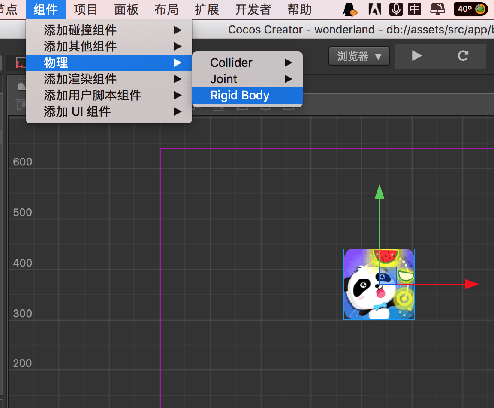
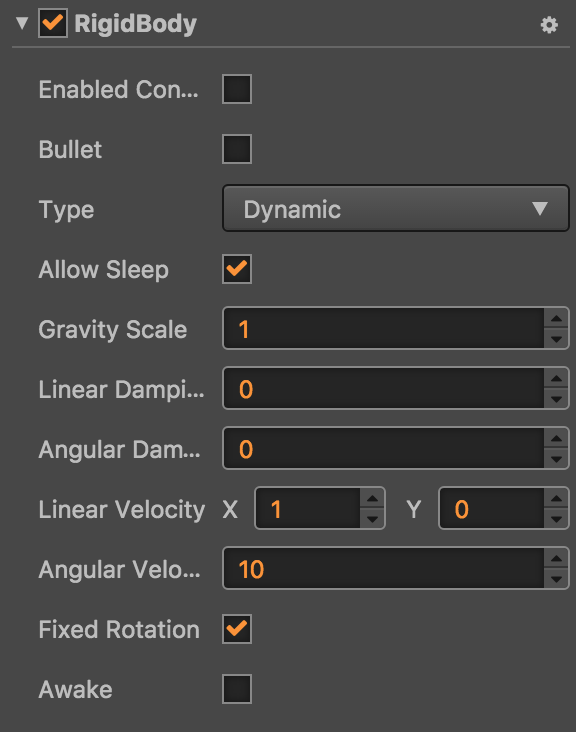

# Cocos Creator使用Box2D物理引擎 

**【原创博文，转载请注明出处！】**  

Cocos Creator从1.5版本开始支持Box2D物理游戏引擎，Box2D是一个优秀的刚体模拟框架，关于Box2D的知识可以去网络上自行了解。本文仅仅探讨如果使用Creator创建一个简单的Demo（Creator版本：1.5beta）。

## 添加RigidBody组件

首先需要在节点上添加一个RigidBody刚体组件。RigidBody组件位置是“组件/物理/Rigid Body”菜单。

  

## RigidBody组件


  

刚体组件可以编辑的属性有以下几项：

- Enabled Contact Listener: 是否开启刚体接触监听器。  
- Bullet: 设置是否设置为子弹类型的刚体。  
- Type: 刚体的类型。  
- Allow Sleep: 是否启用自动休眠。  
- Gravity Scale: 刚体受重力加速度影响的缩放倍数。  
- Linear Damping: 线性阻尼。  
- Angular Damping: 角度阻尼。  
- Linear Velocity: 线速度矢量。  
- Angular Velocity: 角速度。  
- Fixed Rotation: 是否固定选择角度。  
- Awake: 是否唤醒。  

**【详细说明】**  

- Bullet：  

由于box2D进行物理模拟的时候经常会发生形状穿透的问题，对于高速运动的刚体，穿透现象更为普遍。开启Bullet之后，物理引擎将耗费更多的运算在该刚体上，以保证能够正确的进行碰撞等物理模拟。  

- Type：  

box2D内置了3种刚体类型，分别是：Static(静态刚体)、Kinematic(运动学刚体)和Dynamic(动态刚体)。Creator添加了一个Animated(动画刚体)类型。  

- Allow Sleep：

物理运算需要耗费大量的性能，所以对于那些没有物理属性变化的刚体，应该使其休眠，不参与部分物理运算，以此提高box2D的性能。  

- Gravity Scale：

通过修改这个属性，可用控制某些物体受重力影响的大小。  

- Linear Damping：

影响刚体线性运动的物理参数，让刚体移动时，没有摩擦也能慢慢减速。  

- Angular Damping：

和线性阻尼类似，让刚体旋转时，没有摩擦也能慢慢减速。  

- Linear Velocity：

刚体的初始线速度，在下一次物理更新时将被物理运算所改变。  

- Angular Velocity：

刚体的初始旋转角速度，在下一次物理更新时将被物理运算所改变。  

- Fixed Rotation：

启用固定旋转后，刚体不参与旋转的物理模拟，刚体将一直以一个初始角度存在，直到整个属性被禁用后才能旋转。  

- Awake：

是否默认唤醒刚体。  

## 启用物理相关的功能  

编写一个脚本组件，在组件的onLoad方法中添加以下代码：  

```js  
// 启用物理引擎相关功能  
cc.director.getPhysicsManager().enabled = true;  
```

然后将组件添加到场景的Canvas节点上，运行游戏，即可看到添加了RigidBody组件的节点开始做自由落体运动。  


【更多详细的介绍请期待Cocos官方的文档：[http://www.cocos.com/docs/creator/](http://www.cocos.com/docs/creator/)】  

