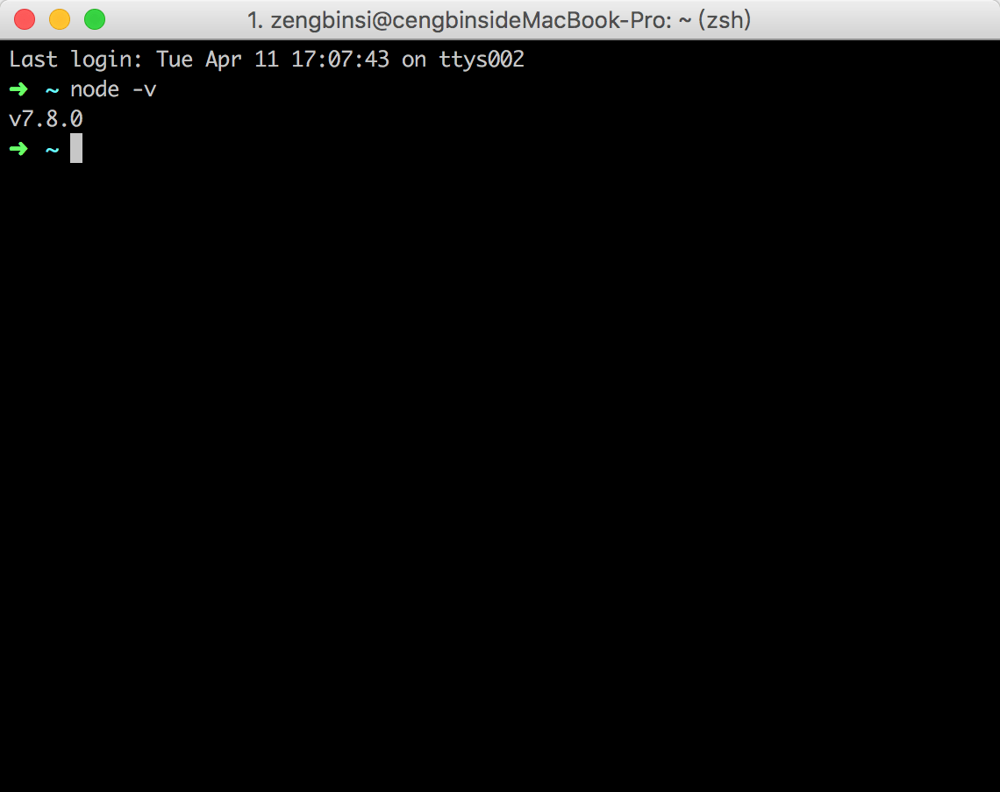
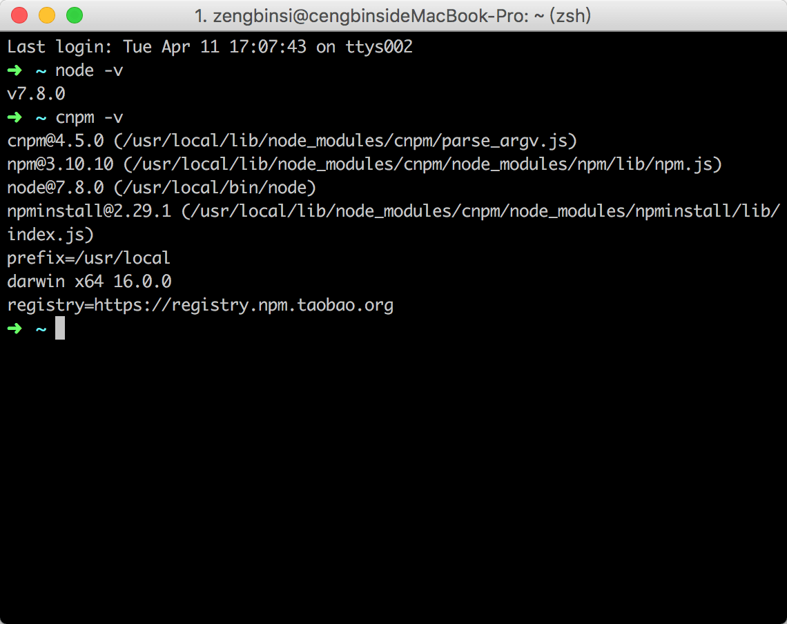
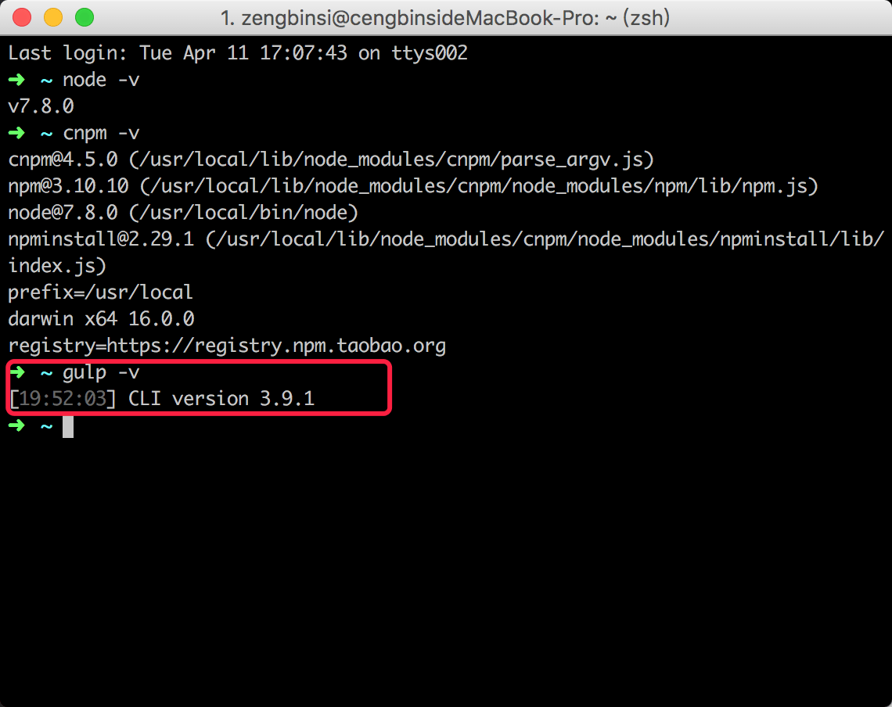
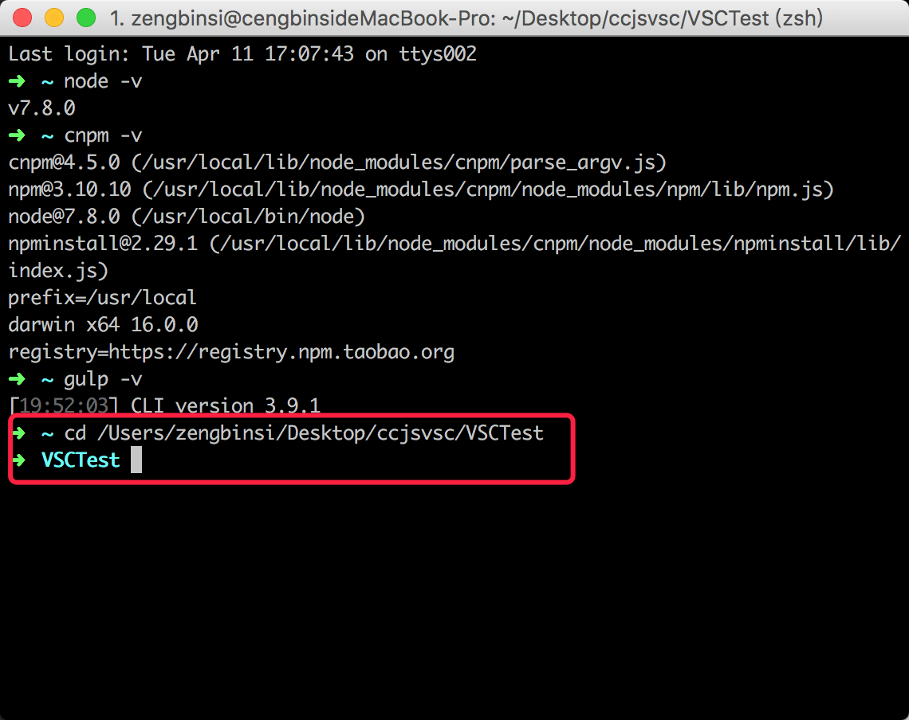
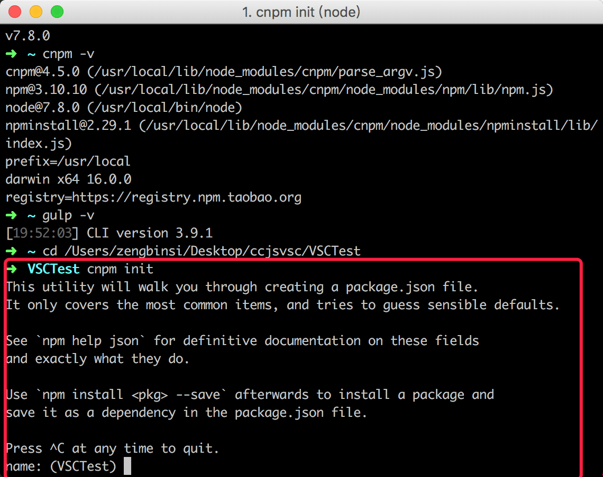
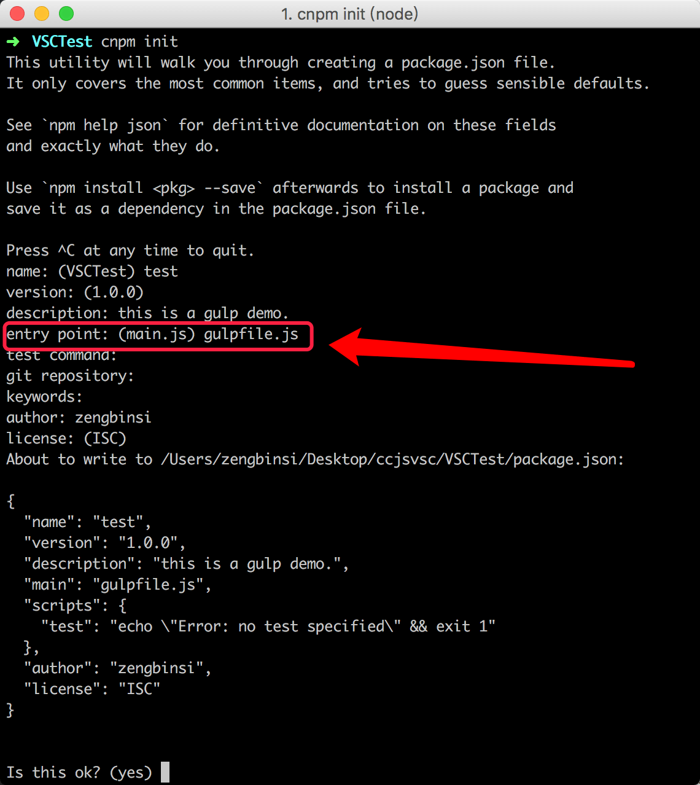
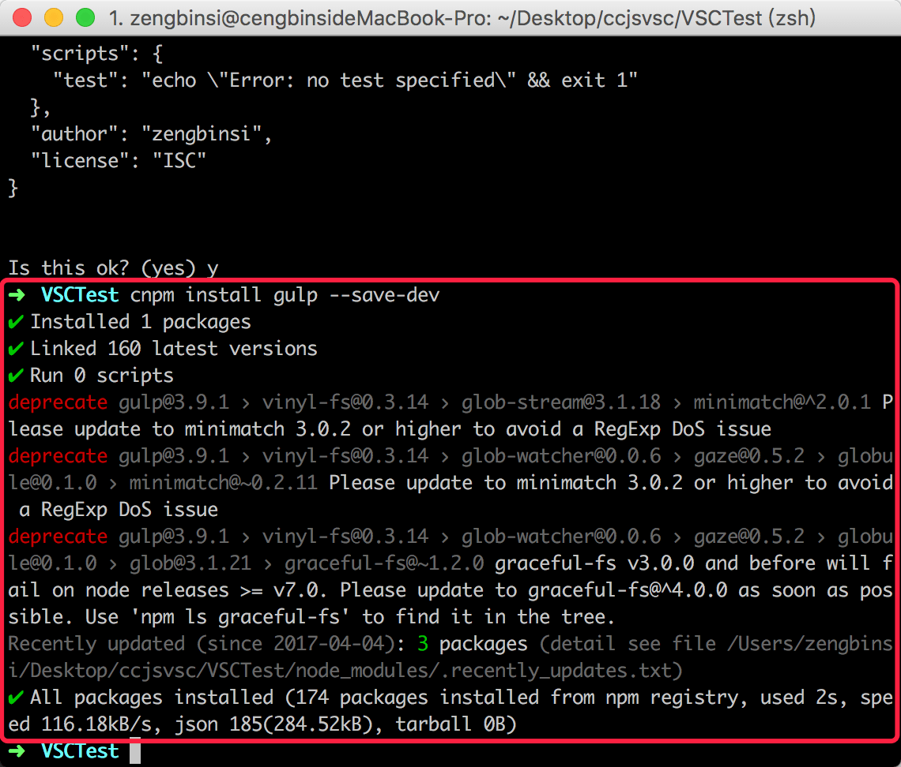
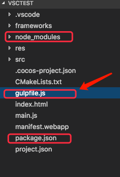
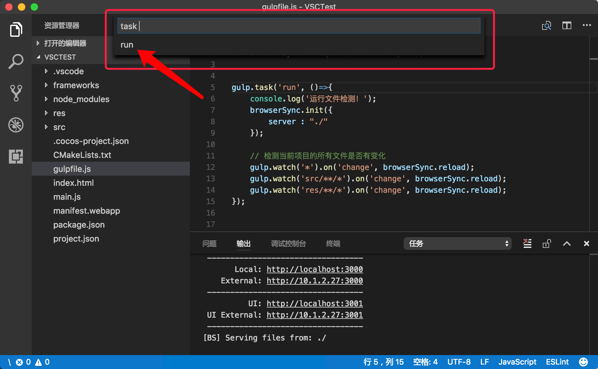
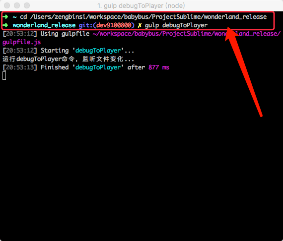

# 使用gulp进行简单的自动化运行调试

- 参考资料:[http://www.gulpjs.com.cn/](http://www.gulpjs.com.cn/)  

## 安装node.JS

搭建gulp的运行环境需要用到npm，所以我们需要先安装node.JS。

### 下载node.JS

**【下载地址】：**  
【Node.JS官网】：[https://nodejs.org/en/](https://nodejs.org/en/)  
【node.JS中文网】：[http://nodejs.cn/download/](http://nodejs.cn/download/)  

进入下载页面，找到系统对应的版本进行下载即可。  
安装结束后，打开终端控制台，输入：

```sh
node -v
```



然后回车，控制台上回显示node的版本信息，如果没有显示，可以注销用户，或者重启计算机试试。  


## 配置cnpm 

由于npm安装插件是从[http://registry.npmjs.org](http://registry.npmjs.org)下载对应的插件包（该网站服务器位于国外，所以经常下载缓慢或出现异常）。所以咱们乐于助人的淘宝团队在国内搭建了一个国内服务器，实现了cnpm。  

服务器地址是：[http://npm.taobao.org](http://npm.taobao.org)  

**这是一个完整 npmjs.org 镜像，你可以用此代替官方版本(只读)，同步频率目前为 10分钟 一次以保证尽量与官方服务同步。**  

配置cnpm的方式也很简单，在终端控制台输入：

```sh
npm install cnpm -g --registry=https://registry.npm.taobao.org
```

安装完成后，最好关闭终端控制台，然后重新打开使用。**直接使用可能会引发错误。**

**cnpm跟npm用法完全一致，只是在执行命令时将npm改为cnpm** 

使用“cnpm -v”可以查看cnpm的版本：

```sh
cnpm -v
```
  

## 全局安装gulp

为了能够在计算机上让gulp直行任务，所以我们需要全局安装gulp。在终端执行：  

```sh
cnpm install gulp -g
```

安装完成后，我们可以同样通过命令查看是否安装成功：

```sh
gulp -v
```

由于我计算机上已经安装好了环境，这里就不截图演示了。

  

## 创建gulp项目

我使用gulp注意是为了在Cocos2d-JS游戏开发过程中避免频繁的切换浏览器刷新，所以以下都是通过该项目进行描述。

## 新建package.json文件

首先，在控制台cd到指定项目的根目录：

  

然后输入：

```sh
cnpm init
```

  

终端停止在上图所示的位置，这时候需要手动输入项目名称，如果直接回车，项目名称将会默认设置为光标前面那个括号里面的内容。  

  

其实没有什么特殊的，我都是直接回车使用默认。 
在“entry point: (main.js)”这一项的时候，我将名称改为“gulpfile.js”。主要是因为通常的JS项目一般都会包含“main.js”文件，为了区分开，所以这里使用了自定义的名称。  

当光标停止在“Is this ok?(yes)”后面时，输入“y”回车即可。

### package.json文件内容介绍 

完成以上步骤，在项目的根目录就自动生成了一个文件，内容大概如下所示（根据个人配置会有一定的出入）：

```js
{
  "name": "test",   		// 项目名称（必须）
  "version": "1.0.0",   	// 项目版本（必须）
  "description": "this is a gulp demo.",   // 项目描述（必须）
  "main": "gulpfile.js",  	// 项目主文件
  "repository": {    		//项目资源库
    "type": "git",
    "url": "http://10.1.0.103:3000/2d/com.sinyee.babybus.wonderland"
  },
  "scripts": {
    "test": "echo \"Error: no test specified\" && exit 1"
  },
  "author": {    			//项目作者信息
    "name": "zengbinsi",
    "email": "zengbinsi@hotmail.com"
  },
  "license": "ISC",    		//项目许可协议
  "devDependencies": {    	//项目依赖的插件
    "gulp": "^3.9.1"
  }
}
```

## 本地安装gulp

为了能正常使用，需要在项目下再次安装gulp。首先，确保终端控制台的工作空间在项目的根目录，然后执行：

```sh
cnpm install gulp --save-dev
```



安装完成后，会在项目的根目录生成一个“node_modules”的文件夹，所有通过npm（cnpm）本地化安装的模块文件都会在这个文件夹里面。  

## 编写gulpfile.js文件  

在项目的根目录新建一个“gulpfile.js”文件，文件名主要是根据pacakge.json里面配置的名称来定的，只有保证两边一致即可。



在gulpfile.js中编辑一下代码：

```js
var gulp        = require('gulp');
var browserSync = require('browser-sync');

// 定义一个名为run的任务
gulp.task('run', ()=>{
    console.log('运行文件检测！');
    browserSync.init({
        server : "./"
    });

    // 检测当前项目的所有文件是否有变化
    gulp.watch('*').on('change', browserSync.reload);
    gulp.watch('src/**/*').on('change', browserSync.reload);
    gulp.watch('res/**/*').on('change', browserSync.reload);
});
```

由于刷新浏览器需要用到“browserSync”，所以我们一起讲其require进来。  

## 运行gulp 

### 在VSCode上执行任务

运行gulp任务的方法有好多种，我开发Cocos2d-JS是使用VSCode进行代码编辑的，在VSCode上，通过Command + P可以显示一个输入框，在输入框中输入“task ”后面跟一个空格，输入框下面的面板就会显示当前项目所有的gulp任务。选择对应的任务即可，当任务启动后，被gulp.watch()监听的目录文件内容发生变化时，浏览器就会进行一次刷新。所有每当写好一句代码，按下保存的时候，浏览器就会自动重新运行项目（需要两个屏幕进行开发，这样才够爽-_-）。



### 在终端执行任务

在公司，开发是使用Quick-Cocos2d-X的，游戏效果也都是在quick-x-player上查看，这时候我的gulp是在终端控制台启动的。命令如下：

```sh
gulp 任务名称 
```

但是在执行命令的时候，确保终端控制台的工作空间在项目的根目录。  



我终端执行的那个gulpfile.js文件内容如下（仅供参考）：

```js

let gulp 		= require('gulp');
let playerPro 	= null;

// 重启模拟器
function restartPlayer() {
	console.log('文件内容变更，重启游戏...');
	// 要打开的项目目录
	let workdir = '/Users/zengbinsi/workspace/babybus/ProjectSublime/wonderland_release',
	// 要打开的项目文件
	file 		= 'scripts/main.lua',
	// 模拟器位置
	quickApp 	= '/Users/zengbinsi/workspace/babybus/ProjectSublime/main/bin/mac/app/quick-x-player.app/Contents/MacOS/quick-x-player';
	// 打开模拟器命令
	let cmd 	= quickApp + ' -workdir ' + workdir + ' -file ' + file + ' -offset {1000, 0} -scale 1 -size 960x540 -console -write-debug-log';
	let exec 	= require('child_process').exec;
	let spawn 	= require('child_process').spawn;

	// 根据进程句柄关闭模拟器
	if (playerPro !== null) {
		playerPro.kill();
		playerPro = null;
	}

	// 重新打开模拟器, 返回一个进程句柄  
	playerPro 	= exec(cmd, function (err, stdout, stderr) {
		if (err) {
			// 如果有引发一场，关闭进程  
			if (playerPro !== null) {
				playerPro.kill();
				playerPro = null;
			}
		}
	});
}


// 定义任务
gulp.task('debugToPlayer', () => {
	console.log('运行debugToPlayer命令，监听文件变化...');
	// 检测当前项目的所有文件是否有变化
    // gulp.watch('*').on('change', restartPlayer);
    gulp.watch('scripts/**/*').on('change', restartPlayer);
    gulp.watch('res/**/*').on('change', restartPlayer);
});
```

这时候，一旦项目文件内容被更改，模拟器就会进行一次刷新。  